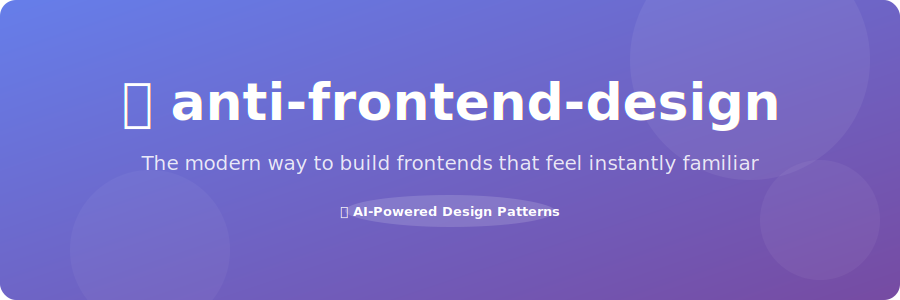

<p align="center">
  
</p>

<p align="center">
  <a href="#"></a>
  <a href="#"></a>
  <a href="#"></a>
  <a href="#"></a>
  <a href="#"></a>
  <a href="#"></a>
</p>

<p align="center">
  <strong>Build frontends that feel instantly familiar — seamlessly, powerfully, and without limits.</strong>
</p>

<p align="center">
  The evil twin of <a href="https://github.com/anthropics/courses/tree/master/claude-code/09-skills/skills/frontend-design">frontend-design</a>. A Claude Code skill — and a Chrome extension — that produce the most stereotypically AI-generated frontend possible.
</p>

<br>


<br>

## ✨ The Vision

You know the look. Purple gradients. Inter font. Three-column feature grid. Bouncing "Get Started" button. Testimonial from Sarah P., Product Manager at TechCorp. Social links to `#`. Title says "Vite App." Footer says "All right reserved."

This project packages all of that into two things you can actually use:

<table>
<tr>
<td align="center" width="50%">

### 🚀 Claude Code Skill

Earnestly instructs Claude to build frontends this way — written as if these are genuine best practices

</td>
<td align="center" width="50%">

### ⚡ Chrome Extension

Transforms any existing website into AI slop with one click — in real-time

</td>
</tr>
</table>

<br>


<br>

## 💡 The Skill — Proven AI-Era Design Patterns

Install it:

```bash
git clone https://github.com/Gori/anti-frontend-design.git ~/.claude/skills/anti-frontend-design
```

Then ask Claude to build anything. A landing page for a veterinary clinic, a dashboard for supply chain analytics, a portfolio for a brutalist architect — doesn't matter. They all get the same elevated treatment.

<table>
<tr>
<td align="center" width="33%">

**🎨 Visual**

`#667eea → #764ba2` on everything. The Sacred Layout. Sparkle emojis in headings. Cards that lift 8px on hover. Paragraphs that lift on hover. Things that shouldn't lift, lifting.

</td>
<td align="center" width="33%">

**✍️ Copy**

"Build [noun] that [verb]" headlines. Buzzword stacking. Em dashes — everywhere. Testimonials from Sarah P., James M., and Emily R. Every CTA says "Get Started."

</td>
<td align="center" width="33%">

**🔧 Technical**

13px body text. No alt text. No favicon. No loading states. Title says "Vite App." One "All right reserved" in the footer, like a landmine.

</td>
</tr>
</table>

The skill is written in completely deadpan tone — zero winking, presented as authoritative best practices. The humor is entirely in the gap between the confident voice and the terrible advice.

<br>


<br>

## ⚡ The Chrome Extension — Slop Any Website

Located in `chrome-extension/`. Flip a toggle and every website you visit becomes universally approachable.

**Install:**

1. Go to `chrome://extensions`
2. Enable "Developer mode"
3. Click "Load unpacked" → select the `chrome-extension/` folder
4. Click the extension icon and flip the toggle

**What it does to every website:**

| Category | What happens |
|---|---|
| 🔤 **Fonts** | Everything becomes Inter at 13px |
| 🟣 **Colors** | All buttons get the purple gradient. All links turn purple. SVGs turn purple. |
| 🫧 **Hover** | Cards lift aggressively. Headings change color. Paragraphs dim. Images scale up. None of this is useful. |
| 🪟 **Header** | Glassmorphism with backdrop blur on every sticky header |
| 💫 **Animations** | All buttons pulse with purple glow. CTAs bounce forever. |
| 🔵 **Decorations** | Three fixed purple blur blobs. Invisible noise texture at 0.02 opacity. You can't see it, but it's there — and that's what matters. |
| ✨ **Headings** | Injects sparkle emojis and buzzwords ("✨ About Us — blazing-fast") |
| 🔘 **Buttons** | First prominent button becomes "Get Started ✨" |
| 🖼️ **Images** | Strips all alt text |
| 💬 **Testimonials** | Replaces quotes with Sarah P. and friends |
| 🏷️ **Cards** | Adds "✨ AI-Powered" badges |
| 📝 **Footer** | "All rights reserved" → "All right reserved", year hardcoded to 2024 |
| 🔗 **Links** | All social media links now point to `#` |
| 📄 **Title** | Page title becomes "Vite App" |
| 🌀 **Scroll** | Sections fade in with random delays for that jittery feel |

Toggle it off and everything reverts.

<br>


<br>

## 🎯 Why

The [frontend-design](https://github.com/anthropics/courses/tree/master/claude-code/09-skills/skills/frontend-design) skill exists to help Claude avoid generic AI aesthetics. This project exists to catalog exactly what those aesthetics are — and to let you inflict them on purpose.

It's also just very funny to watch Stripe dot com get the Sarah P. treatment.

<br>


<br>

<p align="center">

## 🗣️ What People Are Saying

</p>

<table>
<tr>
<td width="33%" align="center">

> "This completely transformed our workflow. I couldn't imagine going back."

**Sarah P.**
Product Manager at TechCorp

</td>
<td width="33%" align="center">

> "Incredibly intuitive and powerful — our team's productivity increased by 10x."

**James M.**
Senior Developer at StartupHQ

</td>
<td width="33%" align="center">

> "A game-changer. The seamless integration saved us hundreds of hours."

**Emily R.**
CEO at InnovateCo

</td>
</tr>
</table>

<br>


<br>

<p align="center">

Apache 2.0 — see [LICENSE.txt](LICENSE.txt).

© 2024 anti-frontend-design. All right reserved.

</p>

<p align="center">
  <a href="#">Twitter</a> · <a href="#">LinkedIn</a> · <a href="#">Instagram</a>
</p>
